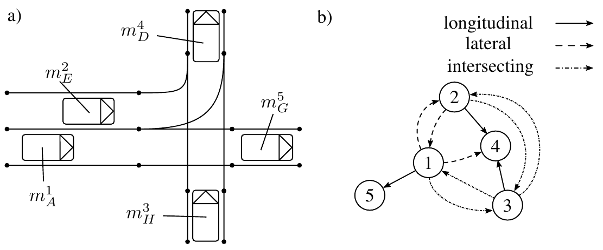
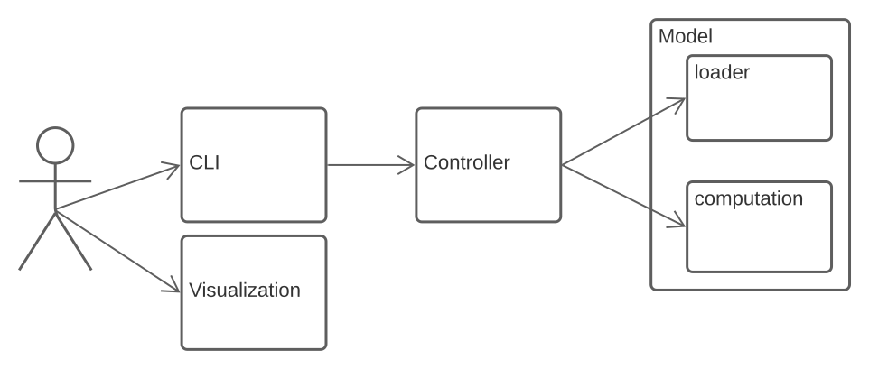
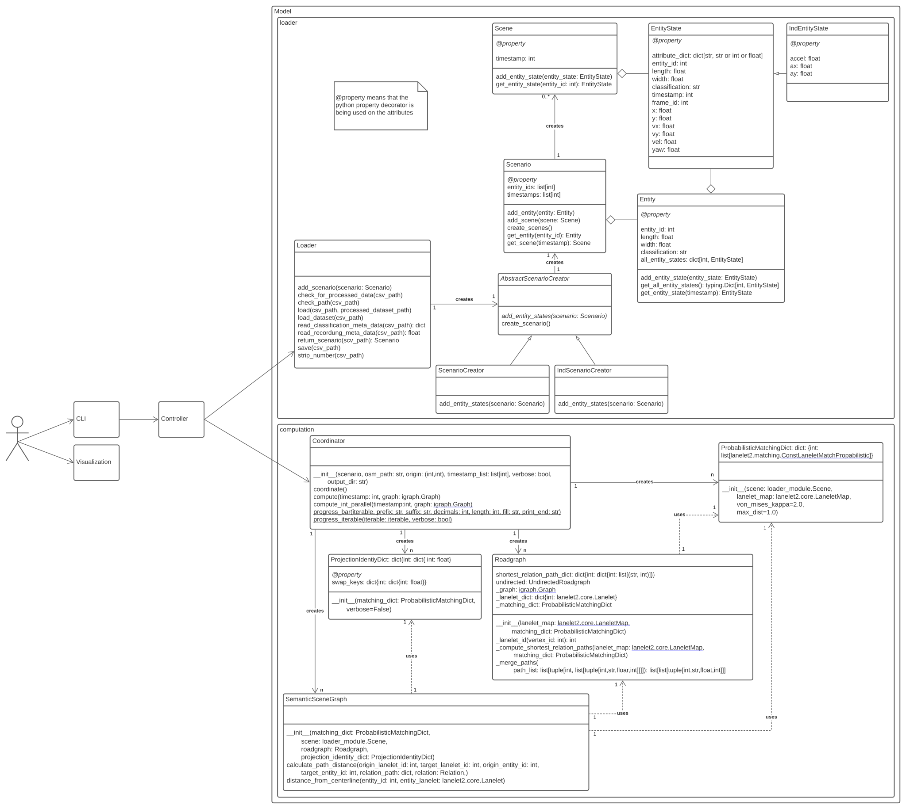

# Semantic Scene Graph

The Semantic Scene Graph model is utilized to describe traffic scenes in relation to road topology and to compare different scenes with each other, independent of the location. The relations between traffic participants are described by semantically classified edges.  
This abstract description facilitates machine readability and makes it practical to apply machine learning methods to traffic scenes.
For more information the reader is refereed to the paper [1].



## Structure

This Project is split up into this main repository and two submodules:

- Computation
- Visualization

To use this main repository and the CLI functionality you need to at least pull both the Loader and the Computation module.

### Architecture Overview



See a more detailed view <details><summary>here</summary>


</details> or in the separate submodules.


## Dependencies

- [csv Motion Dataset Loader](https://github.com/fzi-forschungszentrum-informatik/CSV_Motion_Dataset_Loader)
  - Clone from git and `cd` into the cloned repository
  - `pip install .` to install the loader to the current virtual environment
- [Lanelet2](https://github.com/fzi-forschungszentrum-informatik/Lanelet2) for computation submodule
- Python 3.9 for computation and loader
  - Python dependencies can be installed with `pip3 install -r requirements.txt`. 
- nodejs and npm for Visualization.

## Documentation

Requirements:
[pdoc](https://pdoc.dev/)
```bash
pip install pdoc
```

A doc-file can be generated by
```bash
cd semantic_scene_graph
export PYTHONPATH=$PYTHONPATH:$(pwd)
pdoc ./../sematic_scene_graph/ -o docs
```
The documentation can then be found [here](docs/index.html) (to be opened with a browser).


## Usage

Run `python cli.py [OPTIONS]`. The calculated Semantic Scene Graphs are being written to the folder `dotGraphOutput`.

```none
usage: cli.py [-h] [-v] [--list_aliases] [--save_alias ALIAS] [-c] [-a ALIAS [timestamps ...]] csv_path osm_path x_origin y_origin [timestamps ...]

Create a Semantic Scene Graph from a dataset in the TAF or the inD format.

positional arguments:
  csv_path              the csv file location. The csv file can either be formatted in the TAF format or in the inD format.
  osm_path              the osm file location. The osm file describes the map of the traffic scenario
  x_origin              the x value of the origin of the provided dataset
  y_origin              the y value of the origin of the provided dataset
  timestamps            all timestamps that are supposed to be calculated. Default if left empty is all timestamps in the csv file.

optional arguments:
  -h, --help            show this help message and exit
  -v, --verbose         activates verbose cli feedback
  --list_aliases        lists all saved locations and their aliases
  --save_alias ALIAS    save the given csv, osm and origin information so it can be used with the alias later
  -c, --clean_load      loads the csv file again if it already has been loaded
  -a ALIAS [timestamps ...], --alias ALIAS [timestamps ...]
                        loads the dataset of the given alias and creates its Semantic Scene Graphs for either the provided timestamps
                        or the whole scenario. This option has to be the last option if it is used.

```

### Example usage

```none
python cli.py ./tests/data/vehicle_tracks_000.csv ./tests/data/K733.osm 49.005306 8.4374089 --save_alias taf000
```

Loads the Loader, runs the computation and saves the Semantic Scene Graphs for all timestamps in the dataset. Saves the csv and osm paths along the origin coordinates into cli_aliases.csv.

```none
python cli.py -a taf000 100
```

Loads the information (csv_path, osm_path, origin) saved on the alias `taf000` and runs the program with it but only on timestamp `100`.

## Troubleshooting during development

### Can't find installed Lanelet2

Run `source devel/setup.bash` from the ros directory in which Lanelet is installed.

### Can't find parent module

Run `export PYTHONPATH=$PYTHONPATH:path/to/parent/module/` to register the parent module as a python module. Adding relative paths does not work as well because it actually writes the relative path into the variable.

### References

[1]
M. Zipfl and J. M. Zöllner, “Towards Traffic Scene Description: The Semantic Scene Graph,” p. 8. [DOI: 10.1109/ITSC55140.2022.9922469](https://ieeexplore.ieee.org/document/9922469)

### Licenses

| Library       | License            |
|---------------|--------------------|
| pandas        | BSD 3              |
| python_igraph | GNU GPL 2 or later |
| ray           | Apache License 2.0 |
| electron      | MIT                |
| chokidar      | MIT                |
| chalk         | MIT                |
| vite          | MIT                |